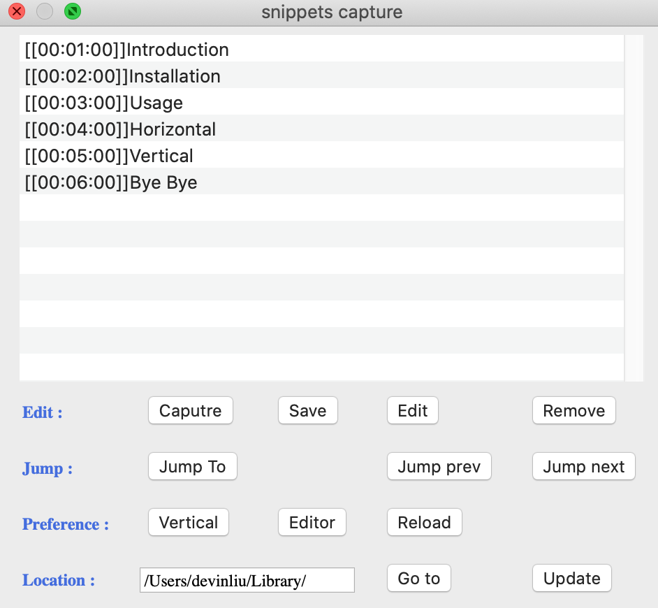
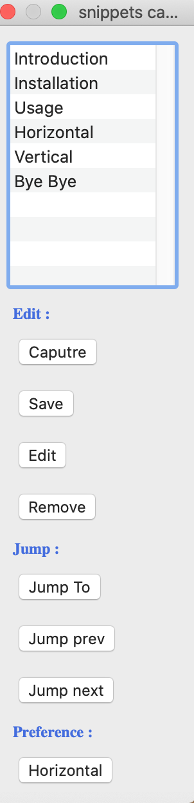
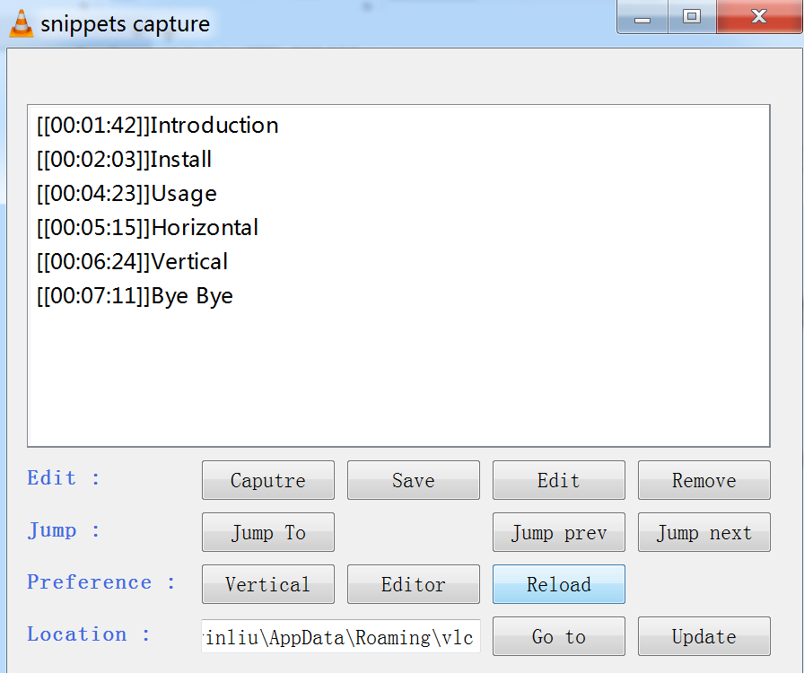
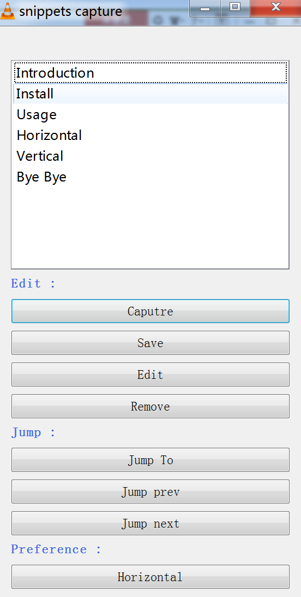
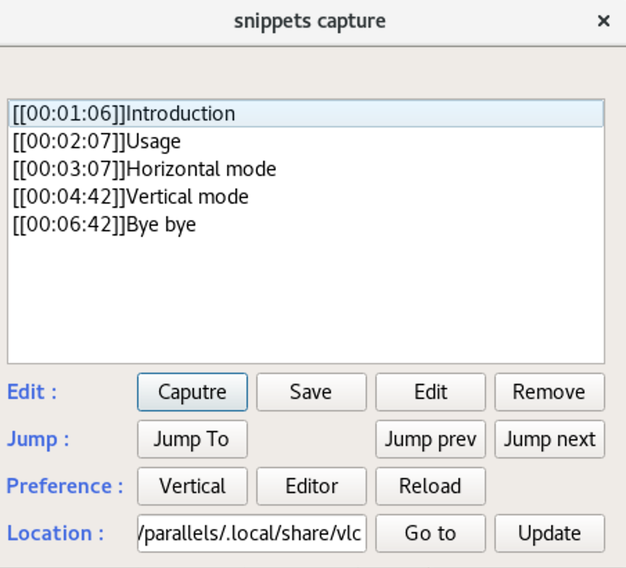
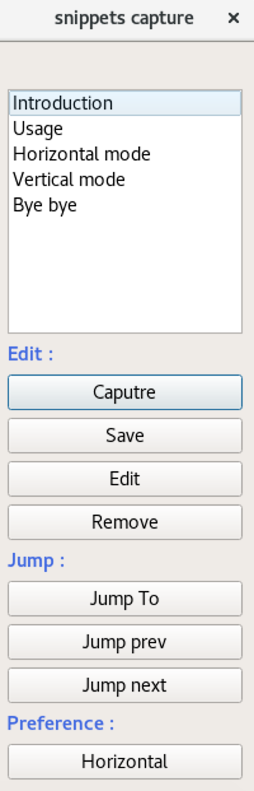

# vlc-bookmarks-editor
vlc extension to create and edit bookmarks.

## overview

The default `Bookmark` of vlc cannot store bookmarks permanently. After closing the media, the bookmarks gone. So we need a bookmark editor to store the bookmarks permanently.

**moment Track** is a very popular bookmark editor. It works well on windows and linux, but it usually doesn't work on mac. So I developed this extension `bookmark editor`

It also has unique features.

**1. seperate media bookmarks file**

`bookmark editor` stores a separate file for each media bookmarks.  the file is  named after the media name, with the extension `.txt`. The default storage path is the vlc user config path.  they are 
-  `/User s/user_name/Library/Application\ Support/org.videolan.vlc` on Mac, 
- `%APPDATA%\vlc` on Windows, 
- `/home/user_name/.local/share/vlc` in Linux. 

change the `user_name` to your user name.

**2. change directory**

you can modify and update storage path in the editor, wherever you like.

**3. double modes**

`bookmark editor` has two modes, landscape and portrait mode. they look like the picture below

On Mac :

On windows:

On Linux :

There are more functions in landscape mode, you can use Editor to edit, change the storage path, etc. It is also more conducive to editing.

Portrait mode is the default mode, it is more streamlined. It can be dragged to the side of the screen, which is more conducive to capturing bookmarks.

See Usage for specific usage.

## Installation

Download the `bookmark_editor.lua` file and place the file in the vlc extension path. 

- Windows (all users): `program_files\VideoLAN\VLC\lua\extensions\`
- Windows (current user): `%APPDATA%\vlc\lua\extensions\`
- Linux (all users): `/usr/lib/vlc/lua/extensions/`
- Linux (current user): `~/.local/share/vlc/lua/extensions/`
- Mac OS X (all users):`/Applications/VLC.app/Contents/MacOS/share/lua/extensions/`
- Mac OS X (current user): `/Users/user_name/Library/Application\ Support/org.videolan.vlc/lua/extensions/`

change the `program_files` to location where your vlc app located.
change the `user_name` to your user name.

## Usage

**start extension**
- Start vlc and your video
- Click on the menu  `VLC > Extension > VLSub` on Mac OS X or code `View > VLSub`  on windows/linux. Please note that the extension entry on Mac, because some tutorials write that it is in the view, which only works on windows or linux.

**horizontal mode features**
- Capture : pause the video, and text field appears to enter the title for the bookmark
- Save : resume the video , and save the bookmark to drive
- Edit : edit the selection bookmark
- Remove : remove the selection bookmark
- Jump to: jump to the time of current bookmark
- Jump pre : jump to the time of previous bookmark
- Jump next : jump to the time of next bookmark
- Vertical : switch to vertical mode. to make the change work, reactivate the extension
- Editor : edit current media bookmarks file with TextEdit on Mac, Notepad on Windows, gedit on Linux.
- Reload : load the media bookmarks from drive, after you edited the bookmarks file with Editor, or played another media.
- Location : the default location of bookmarks file, you can edit within the extension.
- Go to : open the bookmarks directory with Finder on Mac, explorer on Mac, nautilus in the Linux.
- Update : Store the location in user preference, effective after reactivate the extension, or click the reload button within the extension to make change instantly.

**vertical mode features**
- all the same features are consistent with landscape mode
- horizontal : switch to horizontal mode. to make the change work, reactivate the extension

## See also
